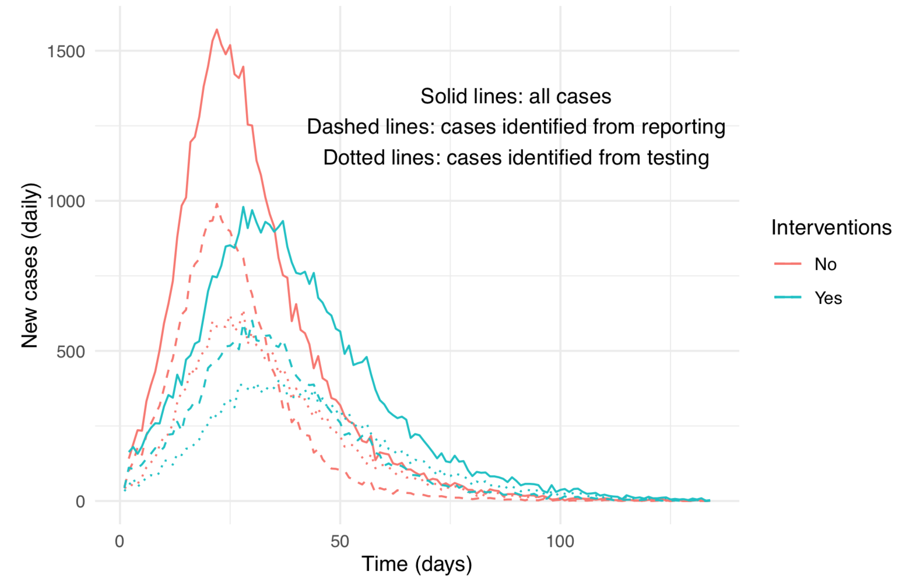
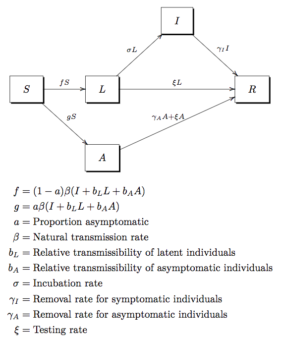
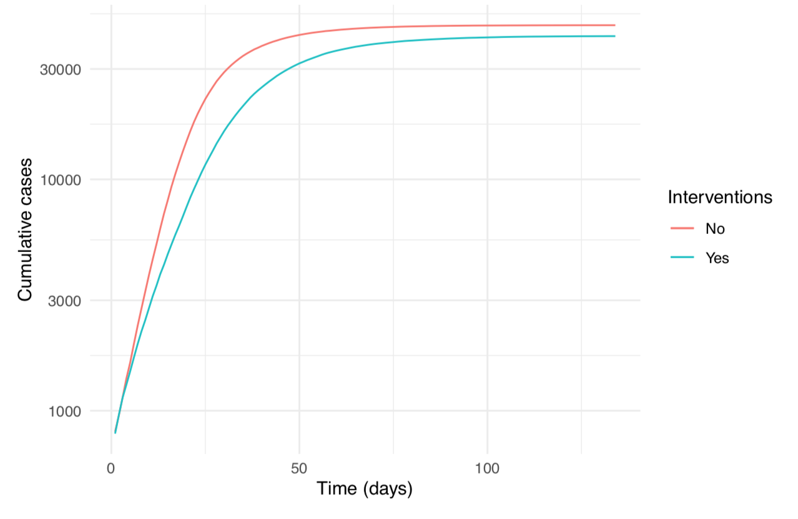
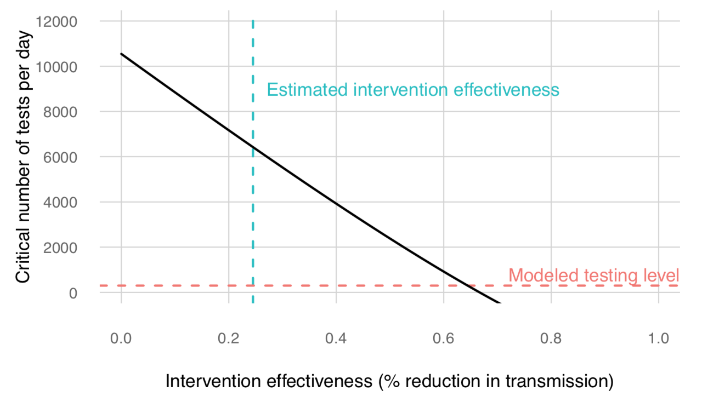

```{r setup, include=FALSE}
knitr::opts_chunk$set(echo = FALSE, cache=TRUE)

library(knitr)
library(scales)

```

```{r parameters}
# General parameters
a <- 0.45 # proportion asymptomatic
a_min <- .4 # min asymptomatic
a_max <- .6 # max asymptomatic
bL <- 0.3
bA <- 0.5
gammaSymp <- 4 # symptomatic infectious period
gammaI <- 1/1
gammaA <- 1/14
sigma <- 1/4
sigma_min <- 1/5
sigma_max <- 1/3
theta <- 100

# University parameters
Ntot <- 50000
N_stud <- Ntot*0.8 # 80% of population are students
N_staff <- Ntot - N_stud
dailytests <- 300
maxTime <- 1000
xi <- dailytests/Ntot # Control parameter (testing rate)

# Intervention parameters
trans_airborne <- .2
trans_droplets <- .4
trans_contact <- .4
reduction_masks <- 0.65
reduction_cleaning <- 0.75 # healthy workplace
reduction_tot <- reduction_masks*(trans_airborne + trans_droplets) + reduction_cleaning*trans_contact

# University-specific interaction parameters
inter_stud_stud <- N_stud^2 - N_stud
inter_stud_staff <- N_stud*N_staff
inter_staff_staff <- N_staff^2 - N_staff
inter_tot <- inter_stud_stud+inter_stud_staff+inter_staff_staff
hours_oncampus <- 15 # hours per week (students)
hours_sleep <- 7*8 # hourse sleep / week
hours_offcampus <-  7*24 - hours_oncampus - hours_sleep # hjours off-campus activity per week
compliance_stud <- hours_oncampus/(hours_oncampus+hours_offcampus)
compliance_staff <- 1
reduction_stud_stud <- reduction_tot * compliance_stud * (inter_stud_stud / inter_tot)
reduction_stud_staff <- reduction_tot * compliance_staff * (inter_stud_staff / inter_tot)
reduction_staff_staff <- reduction_tot * compliance_staff * (inter_staff_staff / inter_tot)
reduction_allinteractions <- reduction_stud_stud + reduction_stud_staff + reduction_staff_staff

# parameter to reduce transmissibility for generalized interventions, expressed as a fraction of natural transmissibility
generalized <- 1-reduction_allinteractions

# Here we solve for beta given a specified R0, setting \xi to 0
findBeta <- function(R0, Ntot, a, bL, sigma, gammaI, bA, gammaA) {
  R0*(Ntot*(1-a)*(bL/sigma+1/gammaI)+Ntot*a*bA/gammaA)^(-1)
}
beta <- findBeta(R0=3, Ntot=Ntot, a=a, bL=bL, sigma=sigma, gammaI=gammaI, bA=bA, gammaA=gammaA)

# Evaluate R0
estimateR0 <- function(beta, Ntot, a, bL, sigma, gammaI, bA, gammaA, xi){
  beta*Ntot*(1-a)*(bL/(sigma+xi)+sigma/(gammaI*(sigma+xi))) + beta*Ntot*a*bA*(1/(gammaA+xi))
}

# Basic Reporduction Number with and without interventions
R0 <- estimateR0(beta=beta, Ntot=Ntot, a=a, bL=bL, sigma=sigma, gammaI=gammaI, bA=bA, gammaA=gammaA, xi=xi)
R0interventions <- generalized*R0
```

```{r initial_condition}
# State of Georgia
cases_7_day_average <- 3500 # 7 day average of case reports, Georgia, Aug 11, 2020
reporting_min <- .25 # reporting probability
reporting_max <- 1.0 # reporting probability
dailyreportable_min <- cases_7_day_average/reporting_max # reportable cases
dailyreportable_max <- cases_7_day_average/reporting_min # reportable cases
active_min <- dailyreportable_min*(1/sigma_max + gammaSymp) # active cases
active_max <- dailyreportable_max*(1/sigma_min + gammaSymp) # active cases
infected_min <- active_min/(1-a_min) # current infections
infected_max <- active_max/(1-a_max) # current infections
pop_GA <- 10456145 # population of Georgia
pop_GA_18_29 <- 1737053 # population of Georgia in the 18-29 age range
pop_GA_percent_18_29 <- pop_GA_18_29/pop_GA # % of population in 18-29 range
cases_GA_percent_18_29 <- .223 # % cases in 18-29 range, Jul 16 - Aug 11, GDPH
prev_min <- infected_min/pop_GA # prevalence
prev_max <- infected_max/pop_GA # prevalence
cases_cum <- 204895 # GDPH
cases_cum_18_29 <- 49423 # GDPH
rel_prev_18_29 <- cases_GA_percent_18_29/pop_GA_percent_18_29 # relative prevalence of 18-29
prev_18_29_min <- prev_min*rel_prev_18_29 # prevalence, 18-29
prev_18_29_max <- prev_max*rel_prev_18_29 # prevalence, 18-29

# University
imports_min <- N_stud*prev_18_29_min # imported cases, min
imports_max <- N_stud*prev_18_29_max  # imported cases, max
imports <- round(mean(c(imports_min,imports_max))) # midpoint of range of imported cases
initial_reported <- 450 # individuals having survived infection prior to start of simulation
initial_removed <- initial_reported * (1/mean(c(reporting_min,reporting_max)))  # correction for under-reporting
S0 <- Ntot-imports-initial_removed
```

# {.tabset .tabset-fade}

## Summary

Numerous American colleges and universities are planning to reopen for fall instruction.
It is widely anticipated that the congregation of students will lead to new outbreaks of COVID&#8209;19.
Institutions have accordingly adopted policies and procedures designed to limit the spread of SARS-CoV-2, but the effectiveness of these procedures is currently unknown.
Models are a useful tool for planning and scenario analysis in the absence of empirical information.
However, there are several information gaps that make modeling of transmission within a university community particularly difficult, including how population segmentation (i.e. faculty, students, and staff) affects transmission; mixing rates among these segments; efficacy of generalized interventions such as wearing face masks, reducing student density, and installing infection barriers; and the extent of airborne, droplet, and surface contact transmission.

As with all current models, the following analysis is subject to these limitations.
We are not, however, completely ignorant about the qualitative and quantitative properties of transmission by symptomatic and asymptomatic persons, the effectiveness of interventions, and usefulness of testing to identify asymptomatic carriers.
In particular, compartmental models have been shown to be robust to a wide range of structural uncertainties and effectively represent the sometimes counter-intuitive properties of epidemics.
Using the State of Georgia as an example, we modeled an outbreak of COVID&#8209;19 for a typical large state university with a population of `r scales::comma(Ntot)`. Key findings of our analysis include:

* **Campus-based interventions are unlikely to prevent an epidemic of COVID&#8209;19 within the campus community.**
* **From 210 to 1618 imported infections may be expected with the arrival of students for Fall 2020.**
* **To reduce the basic reproduction number ($\mathcal{R}_{0}$) to less than one, a testing program would need to administer approximately 6,181 tests per day at typical levels of protection (face masks, social distancing, etc.)**
* **Effective containment of COVID&#8209;19 at large institutions of higher education will require the widespread adoption of behavioral practices among students that reduce transmission of SARS-CoV-2 off-campus.**

```{r, out.width='70%', fig.align='center'}

```

## Model

We developed a compartmental model of COVID&#8209;19 transmission on a university campus that includes asymptomatic transmission and accounts for surveillance testing and case isolation as well as generalized interventions.
Individual persons are classified as Susceptible ($S$), Latent or presymptomatic ($L$), Asymptomatic ($A$), symptomatic and Infectious ($I$), or Removed through recovery or isolation ($R$) (Fig. \ref{fig:university_model}). The $L$, $A$, and $I$ compartments are all considered infectious to varying degrees.

```{r, out.width='70%', fig.align='center', fig.cap='\\label{fig:university_model}Compartmental model for SARS-CoV-2 on a university campus.'}

```

The system of ordinary differential equations for this model is
\begin{align*}
\dot{S} & =-\beta\left(I+b_{L}L+b_{A}A\right)S,\\
\dot{L} & =\left(1-a\right)\beta\left(I+b_{L}L+b_{A}A\right)S-\left(\sigma+\xi\right)L,\\
\dot{A} & =a\beta\left(I+b_{L}L+b_{A}A\right)S-\left(\gamma_{A}+\xi\right)A,\\
\dot{I} & =\sigma L-\gamma_{I}I,\\
\dot{R} & =\gamma_{I}I+\gamma_{A}A+\xi L+\xi A.
\end{align*}

The basic reproduction number for this model is:
\[
\mathcal{R}_{0}=\beta N_{0}\left(1-a\right)\left[b_{L}\frac{1}{\left(\sigma+\xi\right)}+\frac{1}{\gamma_{I}}\left(\frac{\sigma}{\sigma+\xi}\right)\right]+\beta N_{0}ab_{A}\left(\frac{1}{\gamma_{A}+\xi}\right).
\]

(See supplemental information for derivation of $\mathcal{R}_{0}$.)

#### University-specific Parameters

Here we parameterize our model for a large state university, using the demographics and health statistics of the state of Georgia as an example. We assume the university will use testing and case isolation in combination with generalized interventions to reduce transmission. We use our model to examine scenarios for the possibility of outbreak within the university community.

**Total population** = 50,000  
**Student population** = 40,000 (80.0%)  
**Staff population** = 10,000 (20.0%)  

**Tests per day** = 300 (randomized surveillance)  
**Testing rate** $\xi$ = 300 $\div$ 50,000 = 0.6%

Taking into account the demographics and epidemiological data for the state of Georgia (see supplemental information for details), **`r round(imports_min)` to `r round(imports_max)` imported infections may be expected with the arrival of students for Fall 2020.**

We assume a certain number of individuals in the university population will have already recovered from infection prior to the start of the Fall semester. Asuming the number of reported cases in the university prior to the Fall semester is `r initial_reported`, and correcting for under-reporting, we estimate that between `r initial_reported/reporting_max` and `r initial_reported` $\div$ `r reporting_min`  $=$ `r initial_reported/reporting_min` individuals have survived an infection and/or been isolated and have moved into the $R$ class.

#### General disease parameters

We assume the following:  

* Incubation period of `r 1/sigma` days, giving $\sigma=$ `r sigma` [^Zhang2020-ih]&nbsp;[^Li2020-hc]&nbsp;[^Lauer2020-mr].

* Incubating infections are `r scales::percent(bL)` as contagious as symptomatic infections so $b_{L}=$ `r bL`.

* Asymptomatic infections are assumed to be `r scales::percent(bA)` as contagious as symptomatic infections, so $b_{A} =$ `r bA` [^Li2020-hc].

* The contagious period of asymptomatic individuals is assumed to be `r 1/gammaA` days, giving $\gamma_A=$ `r gammaA` [^Long2020-ny]&nbsp;[^Oran2020-aq].

We set recovery rate for symptomatic cases to $\gamma_I=$ `r gammaI`, indicating that symptomatic infectious individuals are assumed removed from the population within one day because of testing or self-reporting and subsequent isolation.

The transmission rate $\beta$ within the university population is estimated from the expression for $\mathcal{R}_{0}$, by setting
$\xi$ to 0 and solving for $\beta$. If we set $\mathcal{R}_{0} = 3.0$ [^Park2020-vl] the estimated transmission rate is $\beta \approx$ `r scales::percent(beta, .0001)`.

#### Intervention and compliance parameters

**Transmission modes:**

1. Aerosolized "airborne" transmission = `r scales::percent(trans_airborne)`  
2. Droplet transmission = `r scales::percent(trans_droplets)`  
3. Contact surfaces = `r scales::percent(trans_contact)`

**Reduction in trasnmission by transmission mode assuming full compliance**

Masks reduce (1) and (2) by about `r scales::percent(reduction_masks)` and "healthy workplace" practices reduce (3) by about `r scales::percent(reduction_cleaning)` [^Offeddu2017-ae]&nbsp;[^Bowen2010-ht]&nbsp;[^Reynolds2016-oy].

Thus, with full compliance, interventions might reduce transmission by `r scales::percent(reduction_tot)`.

**Transmission types:**

1. student-student (`r scales::percent(inter_stud_stud/inter_tot, .1)` of all interactions)
2. student-staff (`r scales::percent(inter_stud_staff/inter_tot, .1)` of all interactions)  
3. staff-staff (`r scales::percent(inter_staff_staff/inter_tot, .1)` of all interactions)  

**Reduction in transmission by transmission type**

We assume that mask and healthy workplace interventions have their estimated effectiveness at all times at which people are engaged in on-campus activities and that all student-staff and staff-staff interactions are on-campus activities, but that off-campus student-student interactions are non-compliant.
We further assume that students spend `r hours_oncampus` hours per week engaged in on campus activities, $7 \times 8 =$ `r hours_sleep` hours per week sleeping, and the remaining $168~-$ `r hours_oncampus` $-$ `r hours_sleep` $=$ `r hours_offcampus` hours per week engaged in off campus activities.
Thus, we estimate that `r hours_oncampus` $/($ `r hours_oncampus` $+$ `r hours_offcampus` $)=$
`r scales::percent(compliance_stud, .1)` of student-student interactions are compliant.
Turning all of this into a weighted average, we assume that the total reduction in transmission due to generalized interventions will be `r scales::percent(reduction_allinteractions, .1)`. 
We do not attempt to separately account for reduction in transmission due to some staff or students performing work or attending class exclusively on-line.

#### $\mathcal{R}_{0}=$ with and without interventions

With the above parameters, we obtain $\mathcal{R}_{0}=$ `r round(R0,2)` for the model with testing but no interventions and $\mathcal{R}_{0}=$ `r round(R0interventions,2)` for the model with testing and interventions. **We therefore conclude that campus-based interventions are unlikely to prevent an epidemic of COVID-19 within a large state university community without additional measures.**

## Results

For illustration, we simulated outbreaks with and without generalized interventions.
In both cases, we assume testing of `r dailytests` asymptomatic persons per day.  The results show that a major outbreak affecting >30,000 persons is the most likely outcome of reopening campus under the assumed conditions.

### Epidemic Curve

```{r, out.width='70%', fig.align='center'}

```

```{r, out.width='70%', fig.align='center'}

```

### Test frequency required to bring $R_0$ to less than one

The testing rate, $\xi$, is an important parameter which can be modified by policy. The probability of an outbreak, represented by the basic reproduction number, can be reduced by increasing the testing rate above a certain critical threshold, which we call the critical testing rate, $\xi_c$. 

See supplmental materials for a detailed explanation of the critical testing rate for our model.

The figure below shows the level of testing that would be required to reduce the effective reproduction number to less than one as a function of the effectiveness of generalized interventions.

```{r, out.width='70%', fig.align='center'}

```

**With no generalized interventions, the critical testing rate is $\xi_c = 0.2$ (equivalent to 9,986 tests per day);<br>with generalized interventions it is $\xi_c = 0.124$ (equivalent to 6,181 tests per day).**

See supplemental materials for sensitivity analysis of the critical testing rate.

### Discission

The above figure shows that actions to reduce transmission are not mutually exclusive and may be used in combination. For instance, a surveillance testing program may be combined with other interventions to achieve containment. Given current circumstances, increasing the effectiveness of interventions and limiting contact among students appear to be the most promising means for effective containment of COVID-19 within institutions of higher education. We identify off-campus student-student interactions to be the arena of intervention with the greatest opportunity for significant reductions in transmission. Particularly, large group gatherings, parties, and congregations in bars, clubs, and other off-campus venues should be strongly discouraged or prohibited. The stabilization and reduction in transmission enjoyed by numerous states and municipalities during Spring 2020 show that containment through behavior change is possible even at very large scales.


<!-- references -->

[^Zhang2020-ih]: Zhang J et al. 2020 Evolving epidemiology and transmission dynamics of coronavirus disease 2019 outside hubei province, china: A descriptive and modelling study. Lancet Infect. Dis. 20, 793–802.

[^Li2020-hc]: Li R, Pei S, Chen B, Song Y, Zhang T, Yang W, Shaman J. 2020 Substantial undocumented infection facilitates the rapid dissemination of novel coronavirus (SARS-CoV2). Science

[^Lauer2020-mr]: Lauer SA, Grantz KH, Bi Q, Jones FK, Zheng Q, Meredith HR, Azman AS, Reich NG, Lessler J. 2020 The incubation period of coronavirus disease 2019 (COVID-19) from publicly reported confirmed cases: Estimation and application. Ann. Intern. Med.

[^Long2020-ny]: Long Q-X et al. 2020 Clinical and immunological assessment of asymptomatic SARS-CoV-2 infections. Nat. Med.

[^Oran2020-aq]: Oran DP, Topol EJ. 2020 Prevalence of asymptomatic SARS-CoV-2 infection. Ann. Intern. Med. in press.

[^Park2020-vl]: Park SW, Bolker BM, Champredon D, Earn DJD, Li M, Weitz JS, Grenfell BT, Dushoff J. 2020 Reconciling early-outbreak estimates of the basic reproductive number and its uncertainty: Framework and applications to the novel coronavirus (SARS-CoV-2) outbreak. J. R. Soc. Interface 17, 20200144.

[^Offeddu2017-ae]: Offeddu V, Yung CF, Low MSF, Tam CC. 2017 Effectiveness of masks and respirators against respiratory infections in healthcare workers: A systematic review and Meta-Analysis. Clin. Infect. Dis. 65, 1934–1942.

[^Bowen2010-ht]: Bowen LE. 2010 Does that face mask really protect you? Appl. Biosaf. 15, 67–71.

[^Reynolds2016-oy]: Reynolds KA, Beamer PI, Plotkin KR, Sifuentes LY, Koenig DW, Gerba CP. 2016 The healthy workplace
project: Reduced viral exposure in an office setting. Arch. Environ. Occup. Health 71, 157–162.

